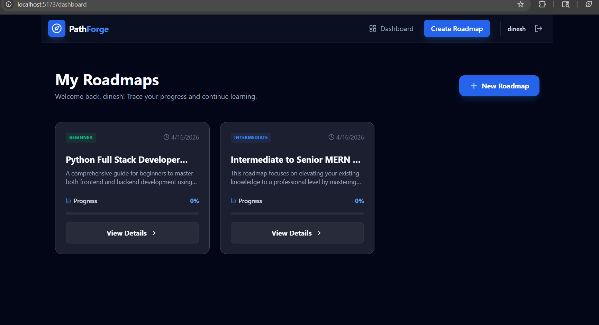
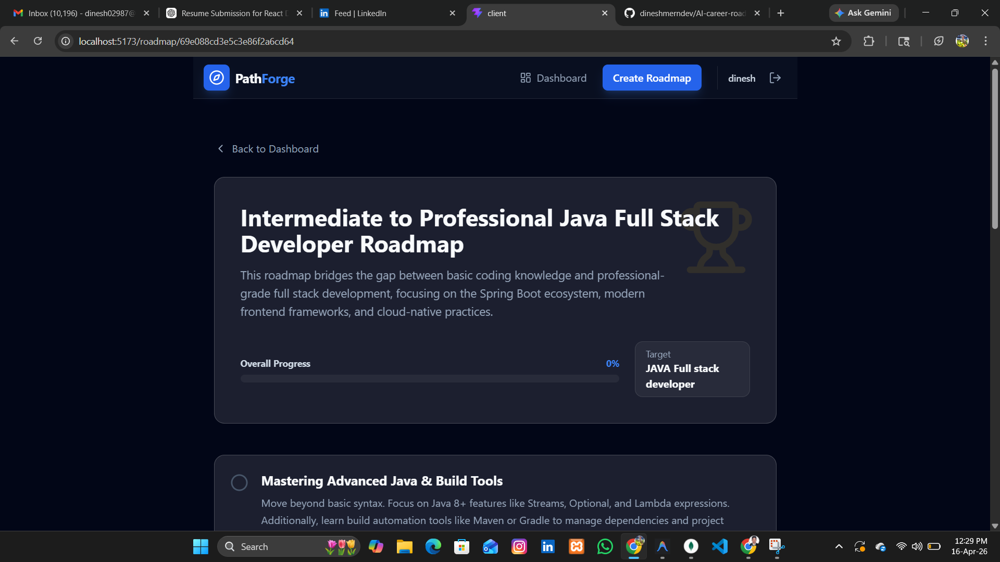
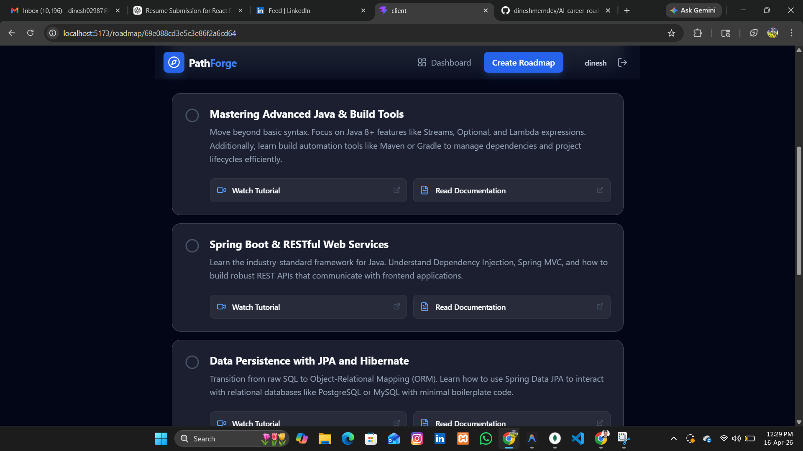
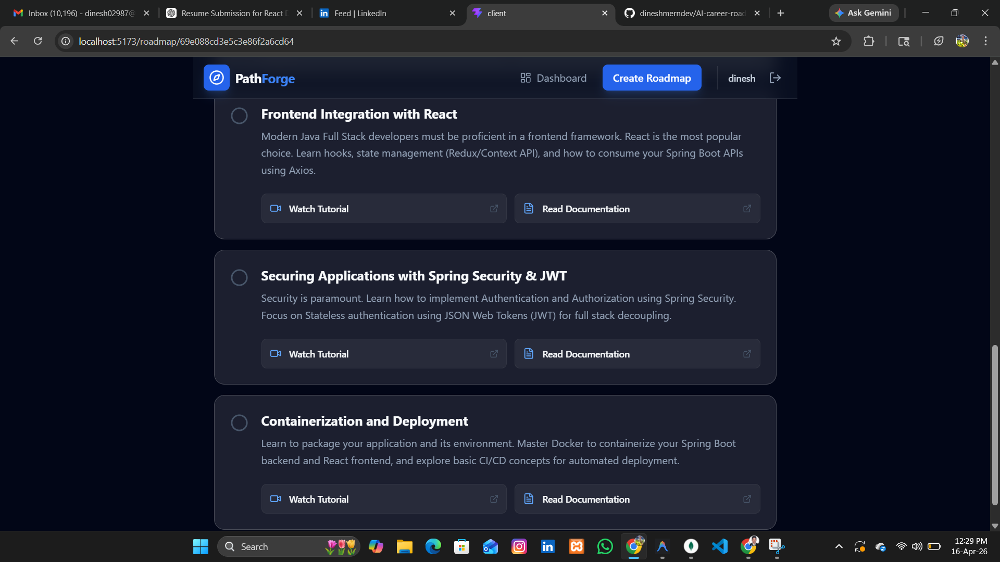

# PathForge AI - Career Roadmap Generator

PathForge AI is a full-stack MERN application that generates personalized career roadmaps using AI. It provides users with a structured learning path, including curated YouTube tutorials and documentation links to help them achieve their professional goals.




## 🚀 Features
- **AI-Powered Roadmaps**: Personalized learning paths powered by Google Gemini AI.
- **Resource Integration**: Direct links to YouTube videos and official documentation for every step (MDN, W3Schools, etc.).
- **User Authentication**: Secure Login and Registration with personalized dashboards.
- **Progress Tracking**: Track your completion status for each roadmap.
- **Modern UI**: Dark-themed, responsive design with glassmorphism aesthetics.

---

## 🛠️ Tech Stack
- **Frontend**: React.js, Tailwind CSS, Framer Motion, Lucide Icons.
- **Backend**: Node.js, Express.js.
- **Database**: MongoDB (Mongoose).
- **AI**: Google Generative AI (Gemini).

---

## 🏃‍♂️ Prerequisites
- [Node.js](https://nodejs.org/) (v16 or higher)
- [MongoDB](https://www.mongodb.com/try/download/community) (Running locally or MongoDB Atlas)
- [Google AI Studio Key](https://aistudio.google.com/app/apikey) (Gemini API Key)

---

## ⚙️ Setup Instructions

### 1. Clone the repository
```bash
# In your terminal
git clone https://github.com/dineshmerndev/AI-career-road-map-generator
cd Career-AI
```

### 2. Backend Setup
```bash
cd server
npm install
```

Create a `.env` file in the `server` directory:
```env
PORT=5000
MONGODB_URI=mongodb://localhost:27017/career_roadmap
JWT_SECRET=your_jwt_secret_here
GEMINI_API_KEY=your_gemini_api_key_here
```

### 3. Frontend Setup
```bash
cd ../client
npm install
```

---

## 🚀 Running the Application

### Start the Backend
```bash
cd server
npm run dev
```
The server will start on `http://localhost:5000`.

### Start the Frontend
```bash
cd client
npm run dev
```
The application will be available at `http://localhost:5173`.

---

## 📁 Project Structure
- **/client**: React frontend (Vite).
- **/server**: Node.js/Express backend.
- **/server/models**: Database schemas (User, Roadmap).
- **/server/controllers**: Request logic (Auth, Roadmap Generation).
- **/server/middleware**: JWT Authentication middleware.

---

## 🔧 Troubleshooting
- **500 Internal Server Error**: Ensure your MongoDB is running and your `GEMINI_API_KEY` is valid.
- **Expired Key**: If you see "API key expired", please generate a new one from Google AI Studio.
- **Registration Error**: If an email is already taken, use the login page or a different email.

---

## 📸 Screenshots

### 🖥️ Dashboard


### ✍️ Input Information


### 🗺️ Generated Roadmap





---

## 📄 License
This project is licensed under the MIT License.
# AI-career-road-map-generator
